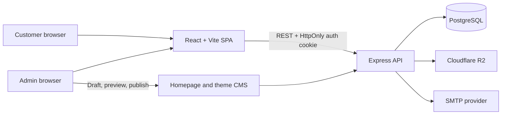

# Butterfly Dream Accessories Platform

Butterfly Dream is a full-stack commerce and content-management platform for an accessories store. One React application powers both the customer storefront and the hostname-separated admin portal, while an Express API manages authentication, catalog data, inventory, orders, website publishing, email, and media storage.

- Storefront: [butterflydream.cc](https://butterflydream.cc)

> [!NOTE]
> The application is under active development. The privacy and terms pages, plus the admin inventory, customers, and notifications screens, currently contain placeholder content. See [Current limitations](#current-limitations).

## Table of contents

- [What the platform includes](#what-the-platform-includes)
- [Architecture](#architecture)
- [Technology stack](#technology-stack)
- [Repository structure](#repository-structure)
- [Prerequisites](#prerequisites)
- [Local setup](#local-setup)
- [Environment variables](#environment-variables)
- [Database and initial administrator](#database-and-initial-administrator)
- [Application routes](#application-routes)
- [API overview](#api-overview)
- [CMS publication flow](#cms-publication-flow)
- [Butterfly animation assets](#butterfly-animation-assets)
- [Scripts](#scripts)
- [Testing and quality checks](#testing-and-quality-checks)
- [Deployment](#deployment)
- [Security notes](#security-notes)
- [Troubleshooting](#troubleshooting)
- [Current limitations](#current-limitations)
- [Contributing](#contributing)
- [License](#license)

## What the platform includes

### Customer storefront

- CMS-driven homepage, announcement bar, theme, fonts, and media
- Product catalog with search, category, price, featured, stock, sorting, and pagination filters
- Product details with variants, images, pricing, and stock availability
- Registration, login, email verification, and password reset
- Authenticated cart, wishlist, checkout, and order confirmation
- Profile, password, delivery-address, order-history, and notification management
- Public reviews with one editable feedback record per customer
- Pop-up and event feed with images, likes, attendance, and comments
- Cash-on-delivery checkout with governorate-specific delivery fees

### Admin portal

- Dashboard metrics for online-order revenue, orders, customers, products, and inventory
- Product, variant, image, status, and stock management
- Category creation, ordering, visibility, and imagery
- Order status, payment status, cancellation, return, and internal-note workflows
- Physical in-store sales and searchable sales history using shared inventory
- Store identity, currency, ordering availability, default delivery fee, and governorate settings
- Homepage section editor, theme editor, media library, draft preview, and publication snapshots
- Pop-up and event creation, publication, ordering, and comment enable/disable controls
- One-time administrator bootstrap with an emailed temporary password

### Commerce and operations

- Online checkout validates and deducts inventory inside serializable PostgreSQL transactions with conflict retries
- Order, product, variant, price, address, and delivery-fee snapshots
- Inventory restoration for eligible cancellations and returns
- Customer in-app notifications and transactional customer emails for order events
- Transactional email for order placement and status/payment changes
- Presigned Cloudflare R2 uploads for product, category, CMS, and event media

## Architecture



The frontend decides which routes to expose from the browser hostname:

| Runtime                               | Routes exposed                                  |
| ------------------------------------- | ----------------------------------------------- |
| Development                           | Both storefront and admin routes                |
| A hostname in `VITE_PUBLIC_HOSTNAMES` | Customer storefront and customer authentication |
| `VITE_ADMIN_HOSTNAME`                 | Admin login and protected admin routes          |
| Any other production hostname         | Not-found route only                            |

The hostname values are embedded at Vite build time. Changing them requires a new frontend build.

## Technology stack

| Area           | Technologies                                                  |
| -------------- | ------------------------------------------------------------- |
| Frontend       | React 19, React Router 7, Vite 8                              |
| UI             | Tailwind CSS 3, MUI, Emotion, styled-components               |
| Animation      | GSAP, ScrollTrigger, canvas, transparent WebP frame sequences |
| Client data    | Axios, native Fetch, and React Context                        |
| API            | Node.js 22, Express 5, ESM                                    |
| Database       | PostgreSQL 16, Prisma 6, `@prisma/adapter-pg`                 |
| Authentication | JWT, HttpOnly cookies, bcrypt                                 |
| Email          | Nodemailer over SMTP                                          |
| Object storage | Cloudflare R2 through the AWS S3 SDK                          |
| Tests          | Vitest, Supertest, Node's test runner                         |
| CI/CD          | GitHub Actions, Render Blueprint, Render Static Site          |

## Repository structure

```text
.
├── .github/workflows/ci.yml       # Client and server CI
├── client/
│   ├── assets-source/             # Source butterfly frames
│   ├── public/                    # Static assets and optimized animation tiers
│   ├── scripts/                   # Asset-generation scripts
│   └── src/
│       ├── components/            # Customer, admin, and shared UI
│       ├── config/                # Host-based runtime selection
│       ├── context/               # Auth, cart, wishlist, notifications, theme
│       ├── layouts/               # Customer, auth, and admin layouts
│       ├── pages/                 # Route-level screens
│       └── services/              # API clients
├── server/
│   ├── config/                    # Validated auth, security, email, and R2 config
│   ├── controllers/               # HTTP request/response handlers
│   ├── middleware/                # Authentication, roles, security, rate limits
│   ├── prisma/                    # Schema, migrations, and seed
│   ├── routes/                    # Public, customer, and admin routes
│   ├── scripts/                   # Admin, R2, and email utilities
│   ├── services/                  # Business and persistence logic
│   ├── src/                       # Express app, server entrypoint, Prisma client
│   ├── tests/                     # Vitest/Supertest integration tests
│   └── utils/                     # Validation, tokens, responses, email templates
├── .nvmrc                         # Node.js 22
└── render.yaml                    # Render API and PostgreSQL Blueprint
```

The client and server are separate npm projects. There is intentionally no root `package.json`, so commands must run inside a package or with `npm --prefix`.

## Prerequisites

- Node.js `>=22.12.0 <23` and npm `>=10 <12`
- PostgreSQL 16 and permission to create a database
- An SMTP account or local SMTP catcher for verification, reset, admin, and order emails
- A Cloudflare R2 bucket, S3 API credentials, and a public bucket/custom-domain URL for media features
- FFmpeg with WebP support only when regenerating the butterfly frames

There is no Docker Compose configuration in this repository; PostgreSQL and any local SMTP service must be started separately.

## Local setup

### 1. Clone and install dependencies

```bash
git clone https://github.com/AIIM00/ButterflyDream.git
cd ButterflyDream

npm --prefix server ci
npm --prefix client ci
```

### 2. Create local environment files

```bash
cp server/.env.example server/.env
cp client/.env.example client/.env
```

Both files are ignored by Git. Never commit credentials or production secrets.

Generate two different secrets for `JWT_SECRET` and `OTP_HASH_SECRET`:

```bash
node -e "console.log(require('node:crypto').randomBytes(48).toString('hex'))"
node -e "console.log(require('node:crypto').randomBytes(48).toString('hex'))"
```

Each generated value is 96 characters. Both backend secrets must contain at least 64 characters.

At minimum, update:

- `server/.env`: PostgreSQL, JWT/OTP, SMTP, and seed/store settings; configure R2 before using media operations and `ADMIN_*` before the optional admin bootstrap
- `client/.env`: `VITE_API_URL`; the production hostname values may remain present during local development

For a local bootstrap email, set `ADMIN_PORTAL_URL=http://localhost:5173/admin/login`.

### 3. Create and prepare PostgreSQL

Create the database referenced by `DATABASE_URL`. For the example configuration:

```sql
CREATE DATABASE accessories_platform;
```

Then generate Prisma Client, apply the checked-in migrations, and seed the store:

```bash
npm --prefix server run db-generate
npm --prefix server run db:deploy
npm --prefix server run db-seed
```

The seed creates store settings when none exist and upserts eight accessory categories.

### 4. Optionally create the first administrator

Configure working SMTP and the `ADMIN_*` values first, then run:

```bash
npm --prefix server run admin:create-initial
```

The script creates only the first admin, emails a generated 24-character temporary password, and forces a password change at first login. It never prints the password. If email delivery fails, it attempts to remove the newly created account.

### 5. Start both applications

Terminal 1:

```bash
npm --prefix server run dev
```

Terminal 2:

```bash
npm --prefix client run dev
```

Open:

- Storefront: [http://localhost:5173](http://localhost:5173)
- Admin login: [http://localhost:5173/admin/login](http://localhost:5173/admin/login)
- API health: [http://localhost:5000/api/health](http://localhost:5000/api/health)

The health endpoint performs a database query, so a `200` response confirms both the API and PostgreSQL connection.

## Environment variables

Start from [client/.env.example](client/.env.example) and [server/.env.example](server/.env.example).

### Client

| Variable                 | Required                             | Purpose                                                                                       |
| ------------------------ | ------------------------------------ | --------------------------------------------------------------------------------------------- |
| `VITE_API_URL`           | Yes                                  | Full API base URL, including `/api`; for example `http://localhost:5000/api`                  |
| `VITE_PUBLIC_HOSTNAMES`  | Production                           | Comma-separated customer hostnames, without protocol or path                                  |
| `VITE_ADMIN_HOSTNAME`    | Production                           | Exact admin hostname; it must not also appear in the public list                              |
| `VITE_CUSTOMER_SITE_URL` | Required for deployed admin previews | Customer origin used when the admin opens a draft preview; the fallback is the current origin |

`VITE_CUSTOMER_SITE_URL` is supported by the application but is not currently present in `client/.env.example`. Set it to `https://butterflydream.cc` on the deployed admin build so preview tabs open the storefront.

### Server: runtime and browser access

| Variable                   | Required           | Purpose / default                                                           |
| -------------------------- | ------------------ | --------------------------------------------------------------------------- |
| `PORT`                     | No                 | API port; defaults to `5000`                                                |
| `NODE_ENV`                 | Yes for deployment | `development`, `test`, or `production`                                      |
| `DATABASE_URL`             | Yes                | PostgreSQL connection URL used by Prisma                                    |
| `CLIENT_URL`               | Recommended        | Customer URL used in order-email links; defaults to `http://localhost:5173` |
| `ALLOWED_FRONTEND_ORIGINS` | Production         | Comma-separated exact origins allowed to make credentialed requests         |
| `TRUST_PROXY`              | No                 | `false`, `true`, or a non-negative proxy-hop count; use `1` on Render       |
| `REQUEST_BODY_LIMIT`       | No                 | JSON and form body limit; defaults to `250kb`                               |

`FRONTEND_URL` remains in `server/.env.example` for compatibility but is not referenced by the current backend. Runtime CORS uses `ALLOWED_FRONTEND_ORIGINS`; customer email links use `CLIENT_URL`.

`ALLOWED_FRONTEND_ORIGINS` accepts origins only, for example `http://localhost:5173`. Do not use a wildcard, route, query string, or trailing path. Production origins must use HTTPS.

### Server: authentication and OTPs

| Variable                              | Required | Purpose / constraint                                                      |
| ------------------------------------- | -------- | ------------------------------------------------------------------------- |
| `JWT_SECRET`                          | Yes      | JWT signing secret; minimum 64 characters                                 |
| `AUTH_SESSION_DAYS`                   | Yes      | Cookie/JWT lifetime; integer from 1 to 30                                 |
| `AUTH_COOKIE_NAME`                    | Yes      | Letters, numbers, dots, underscores, and hyphens only                     |
| `AUTH_COOKIE_SAME_SITE`               | Yes      | `lax`, `strict`, or `none`; local non-HTTPS development cannot use `none` |
| `OTP_HASH_SECRET`                     | Yes      | Separate HMAC secret for OTP hashes; minimum 64 characters                |
| `EMAIL_VERIFICATION_OTP_MINUTES`      | Yes      | Verification-code lifetime; integer from 1 to 30                          |
| `EMAIL_VERIFICATION_OTP_MAX_ATTEMPTS` | Yes      | Verification attempt limit; integer from 1 to 10                          |
| `PASSWORD_RESET_OTP_MINUTES`          | Yes      | Reset-code lifetime; integer from 1 to 30                                 |
| `PASSWORD_RESET_OTP_MAX_ATTEMPTS`     | Yes      | Reset attempt limit; integer from 1 to 10                                 |

### Server: email, seed, and admin bootstrap

| Variable               | Used by         | Purpose                                                                      |
| ---------------------- | --------------- | ---------------------------------------------------------------------------- |
| `SMTP_HOST`            | API             | SMTP hostname                                                                |
| `SMTP_PORT`            | API             | SMTP port from 1 to 65535                                                    |
| `SMTP_SECURE`          | API             | `true` or `false`; commonly `true` for port 465                              |
| `SMTP_USER`            | API             | SMTP login                                                                   |
| `EMAIL_PASSWORD`       | API             | SMTP password or API-generated SMTP key                                      |
| `SENDER_EMAIL`         | API             | From address for transactional email                                         |
| `EMAIL_TEST_TO`        | Email test only | Optional test recipient; falls back to `SMTP_USER`                           |
| `STORE_NAME`           | Seed and email  | Store name, 2 to 160 characters                                              |
| `DEFAULT_DELIVERY_FEE` | Seed            | Non-negative amount with up to two decimal places                            |
| `ADMIN_NAME`           | Admin bootstrap | Initial administrator's display name                                         |
| `ADMIN_EMAIL`          | Admin bootstrap | Mailbox that receives the temporary password                                 |
| `ADMIN_PORTAL_URL`     | Admin bootstrap | Login URL included in the credentials email; HTTPS is required in production |

SMTP variables are validated when the application loads. Use a working provider or a local SMTP catcher even if you are not immediately testing email flows.

### Server: Cloudflare R2

| Variable               | Required for media operations | Purpose / default                                                             |
| ---------------------- | ----------------------------- | ----------------------------------------------------------------------------- |
| `R2_ACCOUNT_ID`        | Yes                           | Cloudflare account ID                                                         |
| `R2_ACCESS_KEY_ID`     | Yes                           | R2 S3 API access-key ID                                                       |
| `R2_SECRET_ACCESS_KEY` | Yes                           | R2 S3 API secret                                                              |
| `R2_BUCKET_NAME`       | Yes                           | Bucket name                                                                   |
| `R2_PUBLIC_BASE_URL`   | Yes                           | Public bucket or custom-domain base URL; trailing slashes are normalized away |
| `R2_PRODUCT_PREFIX`    | No                            | Product object prefix; defaults to `products`                                 |
| `R2_CATEGORY_PREFIX`   | No                            | Category object prefix; defaults to `categories`                              |
| `R2_SITE_MEDIA_PREFIX` | No                            | CMS/event media prefix; defaults to `site/media`                              |

The two latter prefix variables are supported by the backend but are not currently listed in `server/.env.example`.

### Server: rate limits

| Scope           | Window variable                      | Limit variable                     | Default               |
| --------------- | ------------------------------------ | ---------------------------------- | --------------------- |
| All API traffic | `API_RATE_LIMIT_WINDOW_MINUTES`      | `API_RATE_LIMIT_MAX_REQUESTS`      | 500 requests / 15 min |
| Authentication  | `AUTH_RATE_LIMIT_WINDOW_MINUTES`     | `AUTH_RATE_LIMIT_MAX_REQUESTS`     | 30 requests / 15 min  |
| Checkout        | `CHECKOUT_RATE_LIMIT_WINDOW_MINUTES` | `CHECKOUT_RATE_LIMIT_MAX_REQUESTS` | 20 requests / 10 min  |
| Admin API       | `ADMIN_RATE_LIMIT_WINDOW_MINUTES`    | `ADMIN_RATE_LIMIT_MAX_REQUESTS`    | 300 requests / 15 min |

Specific login and OTP limiters are also applied in code.

## Database and initial administrator

### Main data groups

| Group                 | Prisma models                                                                                                              |
| --------------------- | -------------------------------------------------------------------------------------------------------------------------- |
| Identity              | `User`, `OtpCode`, `Address`                                                                                               |
| Catalog and inventory | `Category`, `Product`, `ProductVariant`, `ProductImage`, `Inventory`                                                       |
| Customer commerce     | `Cart`, `CartItem`, `Wishlist`, `WishlistItem`                                                                             |
| Orders                | `Order`, `OrderItem`, `OrderStatusHistory`, `Notification`                                                                 |
| Store operations      | `StoreSetting`, `DeliveryGovernorate`, `Feedback`, `InStoreSale`, `InStoreSaleItem`, `InventoryMovement`                   |
| CMS and social        | `HomeSection`, `MediaAsset`, `SiteTheme`, `SitePublication`, `PopupEvent` and related image/like/attendance/comment models |

Money is stored as PostgreSQL `Decimal(10,2)`. The seed defaults the store currency to USD. Online checkout currently supports cash on delivery.

### Migration workflow

- New local database: `npm --prefix server run db:deploy`
- Check migration state: `npm --prefix server run db-status`
- After editing `schema.prisma`: `npm --prefix server run db-migrate`
- Production/CI: `npm --prefix server run db:deploy`
- Inspect data locally: `npm --prefix server run db-studio`

Commit every generated migration with the schema change that requires it. Do not use `prisma db push` as a replacement for checked-in migrations in shared or production environments.

### Seed behavior

`npm --prefix server run db-seed`:

- creates one store-settings record only when none exists;
- refuses to continue if multiple store-settings rows exist;
- idempotently upserts Necklaces, Bracelets, Rings, Earrings, Watches, Handbags, Hair Accessories, and Customized Accessories.

### Initial administrator guarantees

`npm --prefix server run admin:create-initial`:

- uses a PostgreSQL advisory lock to prevent concurrent first-admin creation;
- refuses to create a second admin or promote an existing customer;
- emails the temporary password instead of logging it;
- requires the new admin to change that password before normal admin operations;
- attempts to remove the new record if credential delivery fails and logs a critical error if cleanup also fails.

## Application routes

### Customer

| Route                                 | Access                             | Purpose                          |
| ------------------------------------- | ---------------------------------- | -------------------------------- |
| `/`                                   | Public                             | CMS-driven homepage              |
| `/products`                           | Public                             | Catalog and filters              |
| `/products/:slug`                     | Public                             | Product detail                   |
| `/popups`                             | Public; interaction requires login | Event and pop-up feed            |
| `/privacy`, `/terms`                  | Public                             | Placeholder legal pages          |
| `/login`, `/register`                 | Public                             | Customer authentication          |
| `/forgot-password`, `/reset-password` | Public                             | Password recovery                |
| `/verify-email`                       | Customer                           | Email verification               |
| `/cart`, `/wishlist`, `/checkout`     | Customer                           | Shopping flow                    |
| `/checkout/success/:orderId`          | Customer                           | Order confirmation               |
| `/account`                            | Customer                           | Profile, password, and addresses |
| `/orders`, `/orders/:orderId`         | Customer                           | Order history and detail         |
| `/notifications`                      | Customer                           | Notification inbox               |

### Admin

`/admin/login` is available in both development and production. On the configured production admin hostname, `/` additionally renders the admin login.

| Route                           | Purpose                                  |
| ------------------------------- | ---------------------------------------- |
| `/admin/dashboard`              | Store metrics                            |
| `/admin/products`               | Product list                             |
| `/admin/products/new`           | Product creation                         |
| `/admin/products/:productId`    | Product, variants, images, and inventory |
| `/admin/categories`             | Category management                      |
| `/admin/orders`                 | Order list                               |
| `/admin/orders/:orderId`        | Order management                         |
| `/admin/in-store-sales`         | Record physical-store sales              |
| `/admin/in-store-sales/history` | Search physical-store sales              |
| `/admin/website`                | Homepage, theme, media, and pop-up CMS   |
| `/admin/settings`               | Store and delivery settings              |
| `/admin/change-password`        | Mandatory initial password change        |

All customer/admin route protection is also enforced by the API. Client-side route guards are not treated as authorization.

## API overview

All endpoints are rooted at `/api`. Responses generally include `success`, `message`, and resource-specific data.

| Prefix                         | Access       | Responsibility                                                                   |
| ------------------------------ | ------------ | -------------------------------------------------------------------------------- |
| `/health`                      | Public       | API and database readiness                                                       |
| `/auth`                        | Mixed        | Registration, login/logout, session, verification, reset, initial admin password |
| `/catalog`                     | Public       | Categories and product queries                                                   |
| `/site`                        | Public/token | Published homepage and signed draft preview                                      |
| `/popups`                      | Public       | Published events and comments                                                    |
| `/feedback`                    | Mixed        | Public reviews and the authenticated customer's review                           |
| `/cart`                        | Customer     | Cart items and price refresh                                                     |
| `/checkout`                    | Customer     | Checkout review and order creation                                               |
| `/customer`                    | Customer     | Profile, addresses, wishlist, notifications, orders, and event interactions      |
| `/admin/dashboard`             | Admin        | Dashboard metrics                                                                |
| `/admin/products`              | Admin        | Products, variants, inventory, and images                                        |
| `/admin/categories`            | Admin        | Categories and category images                                                   |
| `/admin/orders`                | Admin        | Order, payment, status, cancellation, and notes                                  |
| `/admin/in-store-sales`        | Admin        | Physical sales and history                                                       |
| `/admin/settings`              | Admin        | Store settings                                                                   |
| `/admin/delivery-governorates` | Admin        | Delivery availability and fees                                                   |
| `/admin/site`                  | Admin        | CMS sections, media, theme, previews, and publication                            |
| `/admin/popups`                | Admin        | Event and pop-up management                                                      |

Admin endpoints require an `ADMIN` session and completion of the initial password change. Customer endpoints require an active `CUSTOMER` session.

## CMS publication flow

Supported homepage section types are:

- Announcement bar
- Opening slider
- Transformation story
- Categories
- Featured products
- Collections
- Feedback
- Image + text
- Image banner

Admins can create, edit, enable, disable, reorder, and delete sections.

1. Section and theme edits update the draft state.
2. **Preview draft** creates a five-minute signed token and opens the customer site with `#site-preview=<token>`.
3. The client sends the token in `X-Site-Preview-Token` to `/api/site/preview`.
4. **Publish** snapshots the current homepage and theme.
5. `/api/site/home` serves that published snapshot to normal visitors.

Before the first publication exists, the public homepage falls back to the current draft. After the first publish, new homepage/theme edits remain private until the next publish. Media-library operations and pop-up publication are separate from the homepage/theme snapshot; pop-ups have their own draft, published, and archived states.

## Butterfly animation assets

The transformation story preserves the 241-frame transparent butterfly effect while limiting its network and memory cost:

- frame loading waits until the section is near the viewport and the user shows scroll intent;
- `prefers-reduced-motion: reduce` disables frame loading;
- the loader fetches at most three frames concurrently;
- only a 12-frame decoded window is retained;
- stale requests are cancelled as the scroll target changes;
- 1280 px and 1920 px responsive tiers are selected from the viewport and device-pixel ratio.

Source frames:

```text
client/assets-source/butterfly-transformation/transparent/
```

Generated public frames:

```text
client/public/animations/butterfly-transformation/v2/w1280/
client/public/animations/butterfly-transformation/v2/w1920/
```

To regenerate both tiers:

```bash
npm --prefix client run optimize:animation
```

The optimizer requires exactly 241 `frame-0001.webp` through `frame-0241.webp` source files and FFmpeg with WebP support. Set `BUTTERFLY_FFMPEG_PATH` if the executable is not available as `ffmpeg` on `PATH`.

The generated URLs are intended for immutable caching. If frame bytes change after deployment, write them to a new versioned directory and update the config instead of silently replacing cached `v2` assets.

## Scripts

### Client scripts

Run from `client/` or use `npm --prefix client run <script>`.

| Script               | Purpose                                           |
| -------------------- | ------------------------------------------------- |
| `dev`                | Start the Vite development server                 |
| `build`              | Create the production bundle in `client/dist`     |
| `preview`            | Serve the built bundle locally                    |
| `lint`               | Run ESLint across the client                      |
| `test:animation`     | Run frame-loader unit tests                       |
| `optimize:animation` | Regenerate both optimized transparent frame tiers |

### Server scripts

Run from `server/` or use `npm --prefix server run <script>`.

| Script                     | Purpose                                           |
| -------------------------- | ------------------------------------------------- |
| `dev`                      | Start the API with Nodemon                        |
| `start`                    | Start the production API                          |
| `build`                    | Generate Prisma Client                            |
| `test`                     | Run Vitest integration tests serially             |
| `test:watch`               | Run Vitest in watch mode                          |
| `test:db:migrate`          | Apply migrations to the database in `.env.test`   |
| `test:db:reset`            | Destructively reset the database in `.env.test`   |
| `admin:create-initial`     | Create and email the first administrator          |
| `r2:test`                  | Upload, inspect, and delete a temporary R2 object |
| `email:test-transactional` | Send a real test order email                      |
| `db-generate`              | Generate Prisma Client                            |
| `db-validate`              | Validate `schema.prisma`                          |
| `db-migrate`               | Create/apply a development migration              |
| `db:deploy`                | Apply checked-in migrations                       |
| `db-status`                | Show migration status                             |
| `db-seed`                  | Seed store settings and categories                |
| `db-studio`                | Open Prisma Studio                                |

`npm --prefix client run build` does not regenerate the butterfly animation assets.

## Testing and quality checks

### Client

```bash
npm --prefix client run lint
npm --prefix client run test:animation
npm --prefix client run build
```

### Server

Create an isolated test database and copy the backend environment file:

```bash
cp server/.env.example server/.env.test
```

Set `NODE_ENV=test`, use a dedicated `DATABASE_URL` whose database name contains `test`, and provide non-production secrets/configuration. The Vitest suite rejects database URLs that do not contain `test`.

```bash
npm --prefix server run db-validate
npm --prefix server run test:db:migrate
npm --prefix server test
```

The integration suite covers authentication, authorization, session invalidation, temporary-admin gating, security headers, request IDs, CORS, customer profiles, carts, checkout concurrency, inventory, and admin order/payment transitions.

> [!CAUTION]
> `npm --prefix server run test:db:reset` drops and recreates the configured test schema. Run it only against a disposable, dedicated test database.

The URL-name guard runs inside `npm test`, not inside `test:db:migrate` or `test:db:reset`. Inspect `.env.test` before either helper script; those commands trust the configured URL.

GitHub Actions runs client lint/build and the serial server integration suite against PostgreSQL 16 on pushes and pull requests targeting `main`. See [.github/workflows/ci.yml](.github/workflows/ci.yml).

## Deployment

### API and PostgreSQL on Render

[render.yaml](render.yaml) defines:

- a Node web service rooted at `server/`;
- a PostgreSQL 16 database in the same Render region;
- `npm ci --include=dev && npm run build` as the build command;
- `npm run db:deploy` as the pre-deploy migration command;
- `npm start` as the start command;
- `/api/health` as the health check;
- deployment after GitHub checks pass.

Sensitive values marked `sync: false` or without generated values must be entered in Render before the first successful deployment. Do not add them to `render.yaml` or Git.

### Frontend static site

The Render Blueprint does not define the frontend. Configure it as a separate Render Static Site:

| Setting           | Value                     |
| ----------------- | ------------------------- |
| Root directory    | `client`                  |
| Build command     | `npm ci && npm run build` |
| Publish directory | `dist`                    |
| SPA rewrite       | `/*` → `/index.html`      |

Provide these build-time variables:

```dotenv
VITE_API_URL=API_URL
VITE_PUBLIC_HOSTNAMES=butterflydream.cc,www.butterflydream.cc
VITE_ADMIN_HOSTNAME= ADMIN_HOSTNAME
VITE_CUSTOMER_SITE_URL=https://butterflydream.cc
```

`butterflydream.cc`and `www.butterflydream.cc` must all route to this client deployment, and every exact hostname must match the build-time variables. An unknown production hostname intentionally renders only the not-found route.

The current production admin hostname is additionally gated by Cloudflare Access before the application's own admin login. That access policy and the related Cloudflare DNS configuration live outside this repository.

Configure a long-lived immutable cache header for `/animations/butterfly-transformation/v2/*` on the static host. Hashed JS/CSS assets should also receive long-lived immutable browser caching. HTML should remain short-lived so new deployments are discovered.

`client/vercel.json` contains the equivalent SPA rewrite and animation-cache rule for Vercel, but it is not consumed by Render.

### Cloudflare R2

Configure the bucket's browser upload CORS policy to allow the admin origins, the `PUT` method, and the `Content-Type` header. `R2_PUBLIC_BASE_URL` must resolve every finalized object publicly. Product, category, and CMS uploads use five-minute presigned URLs and accept validated JPEG, PNG, or WebP files up to 10 MB.

After deployment, verify:

```text
GET https://api.butterflydream.cc/api/health
```

Then smoke-test customer login, admin login, an R2 upload, draft preview, and checkout against non-production data before changing DNS or accepting orders.

## Security notes

- Passwords are hashed with bcrypt using cost 12.
- JWTs use HS256 with fixed issuer/audience claims and are stored in an HttpOnly cookie.
- Production auth cookies are `Secure`; their SameSite mode is configurable.
- Authenticated requests reload the user and reject deleted, suspended, role-changed, or password-invalidated sessions.
- OTPs are six digits, HMAC-SHA256 hashed, expiring, attempt-limited, single-use, and timing-safe compared.
- Password-reset responses are generic to reduce account enumeration.
- Helmet, production HSTS, exact credentialed CORS, strict body limits, and layered rate limiting are enabled.
- Every API request receives an `X-Request-ID`; unexpected server errors are logged without returning internals.
- Client-side route guards improve UX, but all authorization decisions are enforced again by server middleware.
- Email verification is implemented, but the verification middleware is not currently mounted on cart, checkout, or other customer API routes. An authenticated, active customer can use those APIs before verifying their email.
- Rate limiters currently use the default in-memory store and therefore apply per API process. Configure a shared store before horizontally scaling the API.

Do not expose `JWT_SECRET`, `OTP_HASH_SECRET`, SMTP credentials, R2 keys, or `DATABASE_URL` in `VITE_*` variables. Vite variables are public in the browser bundle.

## Troubleshooting

### The API exits during startup

- Confirm PostgreSQL is reachable from `DATABASE_URL`.
- Make `JWT_SECRET` and `OTP_HASH_SECRET` two distinct values of at least 64 characters.
- Fill every SMTP variable; the mailer validates configuration during module loading.
- Confirm all integer and boolean values match the constraints described above.

### Browser requests receive `403` from CORS

Add the browser's exact origin to `ALLOWED_FRONTEND_ORIGINS`. `http://localhost:5173` and `http://127.0.0.1:5173` are different origins. Restart the API after changing backend environment values.

### Login succeeds but the browser does not retain the session

- Use one consistent hostname for the frontend and API configuration.
- Confirm Axios requests include credentials.
- Use HTTPS in production.
- Check `AUTH_COOKIE_SAME_SITE` and the API's allowed origin list.

### Draft preview opens on the admin domain

Set `VITE_CUSTOMER_SITE_URL` to the customer origin and rebuild/redeploy the frontend. Vite environment values cannot be changed at runtime.

### R2 upload or finalization fails

- Verify the account, bucket, API-token permissions, public base URL, and bucket CORS policy.
- Confirm the public base URL resolves finalized objects; trailing slashes are normalized automatically.
- Run `npm --prefix server run r2:test` with test-bucket credentials.

### A deployed route returns 404 on refresh

Add the static host's SPA fallback from `/*` to `/index.html`. `client/vercel.json` only configures Vercel.

### The butterfly effect does not appear

- Confirm both `v2` tiers contain all 241 frames.
- Check that the transformation section is enabled in the published CMS snapshot.
- Scroll toward the section; loading intentionally waits for proximity and scroll intent.
- Check whether the operating system/browser requests reduced motion.

## Current limitations

- `/privacy` and `/terms` still show placeholder copy and must be completed before launch.
- `/admin/inventory`, `/admin/customers`, and `/admin/notifications` are placeholder screens.
- Online checkout supports `CASH_ON_DELIVERY`; no online card-payment gateway is integrated.
- The in-store-sale schema includes cancellation/refund states, but the API does not currently expose POS cancellation or refund routes.
- There is no generated OpenAPI specification or interactive API documentation.
- There is no Docker Compose development environment.

## Contributing

1. Create a focused branch from `main`.
2. Keep client and server changes scoped; do not commit `.env` files.
3. Add and commit a Prisma migration for schema changes.
4. Run the relevant checks from [Testing and quality checks](#testing-and-quality-checks).
5. If animation frames change, regenerate both tiers, run the animation tests, and publish them under a new versioned path.
6. Document new environment variables in the relevant `.env.example` and in this README.

## License

# Butterfly Dream Proprietary Software License

Copyright © 2026 Butterfly Dream. All Rights Reserved.

This software, including its source code, object code, documentation, designs, graphics, user interfaces, database structures, business logic, branding elements, and associated materials (collectively, the "Software"), is the proprietary property of Butterfly Dream and its respective copyright holder(s).

## 1. Ownership

All rights, title, and interest in and to the Software are reserved by the copyright holder.

No ownership rights are transferred by access to, possession of, or viewing of this repository or its contents.

## 2. Restrictions

Unless prior written permission has been granted by the copyright holder, you may not:

- Copy or reproduce the Software, in whole or in part.
- Modify, adapt, translate, or create derivative works based on the Software.
- Distribute, publish, sublicense, sell, rent, lease, or otherwise make the Software available to another party.
- Use the Software or substantial portions of it in another commercial or non-commercial project.
- Reproduce or imitate proprietary designs, branding, visual assets, or original application components contained within the Software.
- Remove or alter copyright, ownership, or proprietary notices.
- Represent the Software or any substantial portion of it as your own work.

## 3. Authorized Use

Access to this repository does not constitute permission to use the Software.

Any authorization to use, modify, distribute, deploy, or otherwise work with the Software must be provided explicitly by the copyright holder.

Any such authorization is limited to the scope and purpose for which it was granted.

## 4. Third-Party Software

The Software may incorporate or depend upon third-party libraries, frameworks, services, or other software.

Those components remain subject to their respective licenses and terms. Nothing in this license is intended to restrict rights granted independently under applicable third-party licenses.

## 5. Trademarks and Branding

The Butterfly Dream name, branding, logos, visual identity, and related brand assets are not licensed for use under this agreement.

No permission is granted to use Butterfly Dream branding in connection with another product, service, business, or project without prior written authorization.

## 6. No Warranty

THE SOFTWARE IS PROVIDED "AS IS", WITHOUT WARRANTY OF ANY KIND, EXPRESS OR IMPLIED, INCLUDING BUT NOT LIMITED TO WARRANTIES OF MERCHANTABILITY, FITNESS FOR A PARTICULAR PURPOSE, AND NON-INFRINGEMENT.

TO THE MAXIMUM EXTENT PERMITTED BY APPLICABLE LAW, THE COPYRIGHT HOLDER SHALL NOT BE LIABLE FOR ANY CLAIM, DAMAGES, OR OTHER LIABILITY ARISING FROM UNAUTHORIZED OR AUTHORIZED USE OF THE SOFTWARE.

## 7. Reservation of Rights

All rights not expressly granted in writing are reserved by the copyright holder.

Unauthorized copying, modification, distribution, publication, commercial use, or other exploitation of the Software may constitute copyright infringement and may result in legal action.

---

**Butterfly Dream**
Copyright © 2026. All Rights Reserved.
